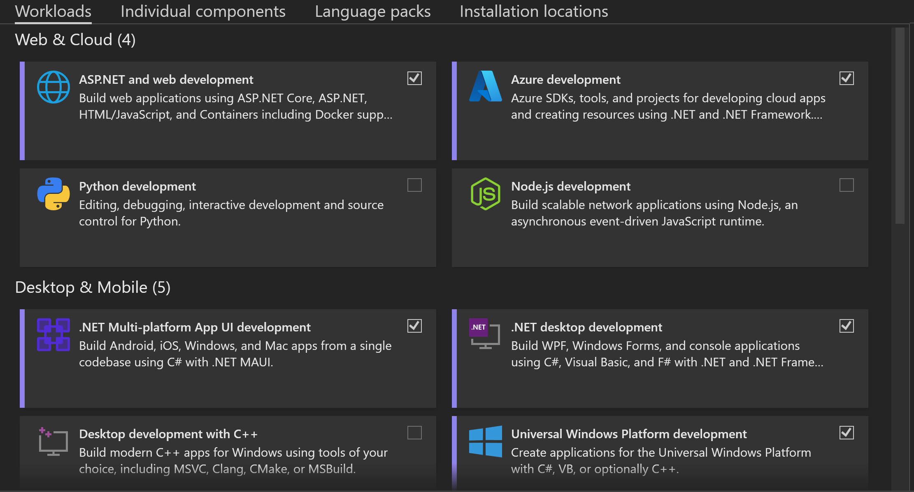

# Code Examples for Software Development I Course

## Introduction

This repository contains code examples and documentation you will see during practice lectures (2026 Fall).

All examples are provided as-is and are intended only for learning purposes. Some examples are designed to display "bad code" or "bad practices", while others might be correct but provide overly simplified solutions. 

⚠️ **Important**: **Never** use the provided examples as production-ready code, as they are not intended for production use.

## Repository Structure

This repository contains a separate folder for each practice lecture (e.g., "Lecture01" for the first lecture).

Each practice lecture folder contains one or more subfolders for the topics that were discussed during that session.

## Getting Started

### File Formats & Tools

#### Quarto Files (*.qmd)
Many examples are provided as `*.qmd` files - [Quarto](https://quarto.org/) documents (plain markdown with executable code blocks). Polyglot Notebooks (`*.dib`/`*.ipynb`) were deprecated by Microsoft in 2026, so examples previously authored as notebooks now use this format instead.

**Requirements**: 
- [Quarto CLI](https://quarto.org/docs/get-started/) - renders pages and slides
- Visual Studio Code with the [Quarto extension](https://marketplace.visualstudio.com/items?itemName=quarto.quarto)

Live-reloading preview of a `.qmd` file while editing:

```
quarto preview <file>.qmd
```

#### LINQ Files (*.linq)
LINQ examples are provided as `*.linq` files for use with LINQPad.

**Requirements**: 
- [LINQPad tool](https://www.linqpad.net/Download.aspx) - for creating, testing, and running LINQ queries

#### Visual Studio Solutions (*.sln)
All code examples provided as Visual Studio solutions were tested and compiled using **Visual Studio 2022** with the following workloads:



**Alternative**: All examples should work with **Visual Studio Code** if you install:
- [C# extension](https://marketplace.visualstudio.com/items?itemName=ms-dotnettools.csharp)
- [C# Dev Kit extension](https://marketplace.visualstudio.com/items?itemName=ms-dotnettools.csdevkit)

## Project Ideas

For team project inspiration, see [PROGRAMS.md](PROGRAMS.md) which contains suggested collaborative entertainment app ideas.

## Theory Lecture Materials

📖 **Theory Slides**: Access slides from theory lectures at [software-engineering repository](https://github.com/smagurauskas/software-engineering/tree/main)

## Demo Project

🚀 **Live Demonstrations**: Follow along with language features and development practices using the [PSI2026-Playground repository](https://github.com/niku-live/PSI2026-Playground)

This repository contains code examples that will be used during lectures to demonstrate various programming concepts, language features, and development techniques.

## Lectures

- [Lecture 01](Lecture01/README.md) - Course Introduction, Teams & Evaluation Process